### 程序演示
运行程序，将显示如下界面：

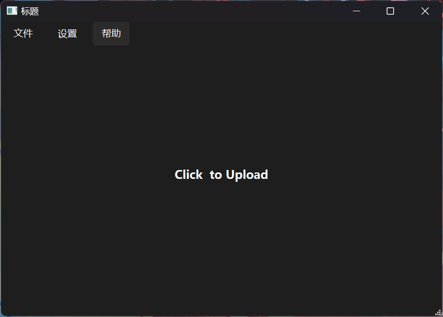

点击中央区域，即可选择上传文件。上传完成后弹出以下界面表示程序正在生成结果：

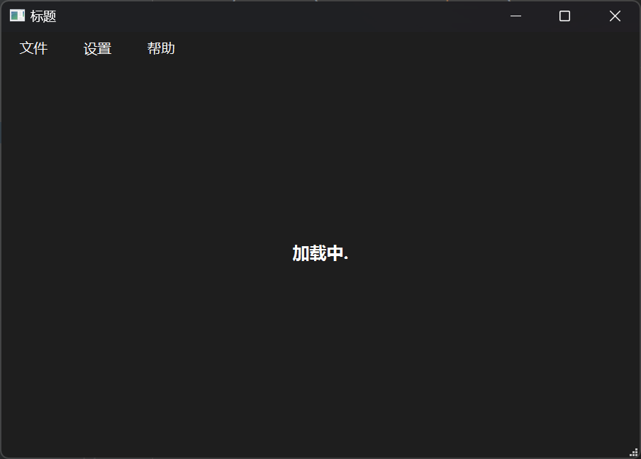

生成完毕后将会显示下列界面。在“程序输出”子页显示了程序的处理结果：

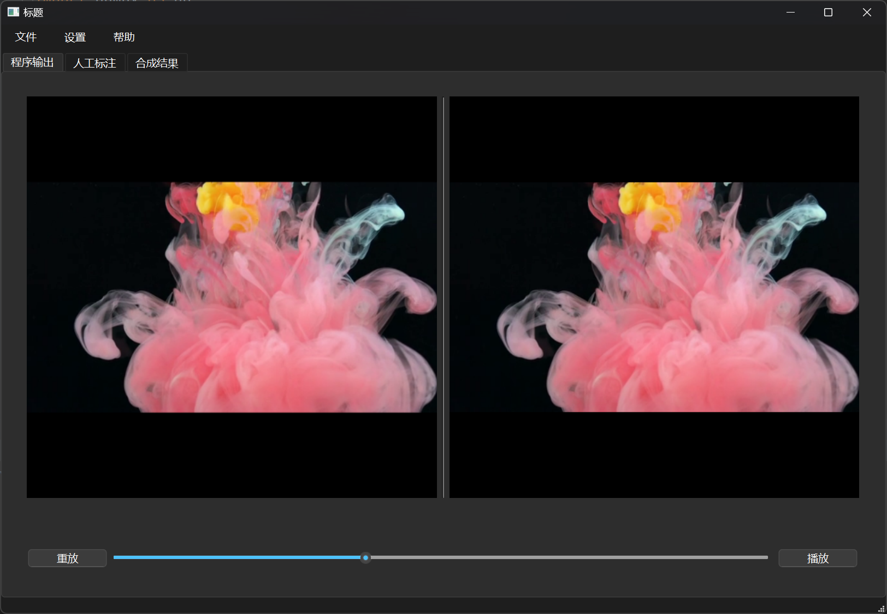

进入“人工标注”子页，点击筛选即可以图片形式展示程序处理结果（尚未实现根据时间段筛选）：

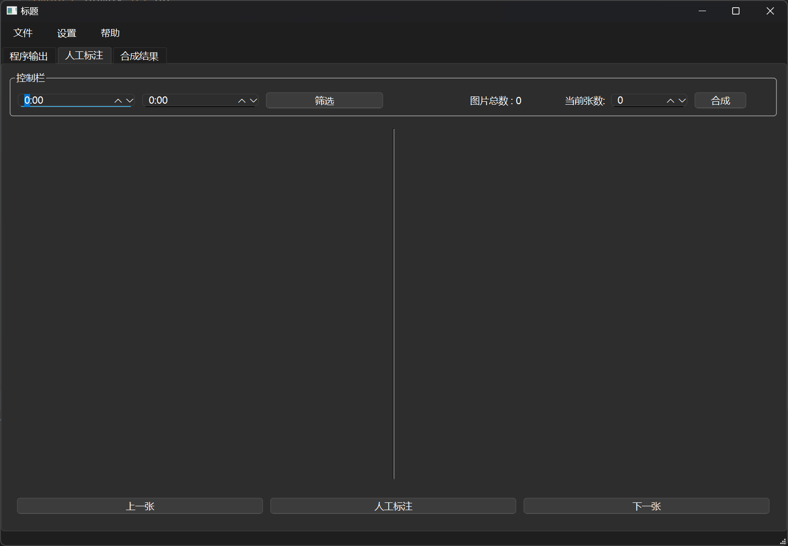

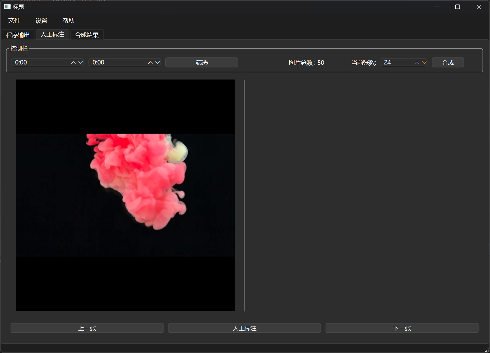

点击人工标注按钮即可加载Anylabeling标注当前图片：

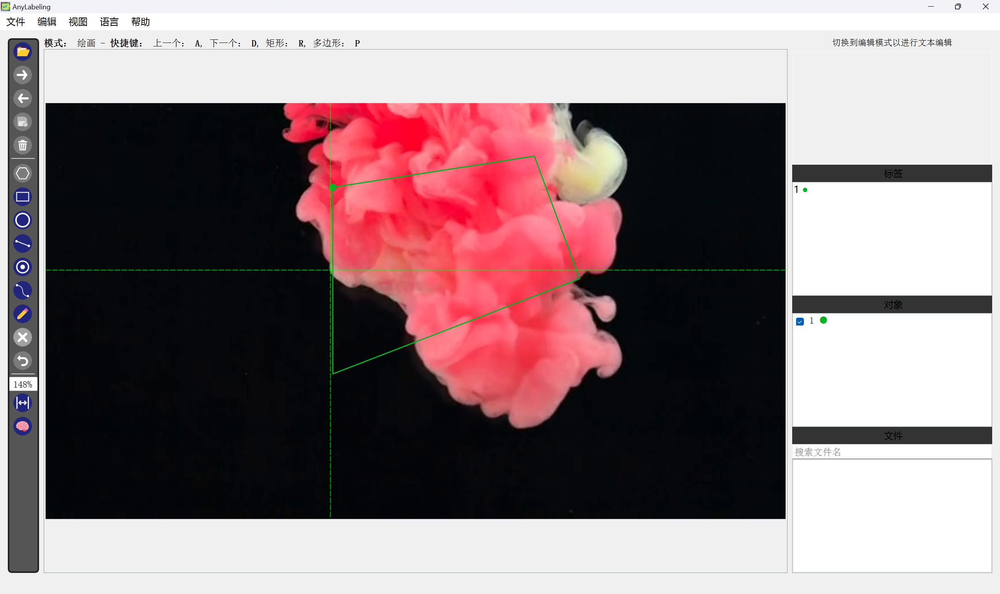

标注完毕后退出Anylabeling，程序将显示标注结果：

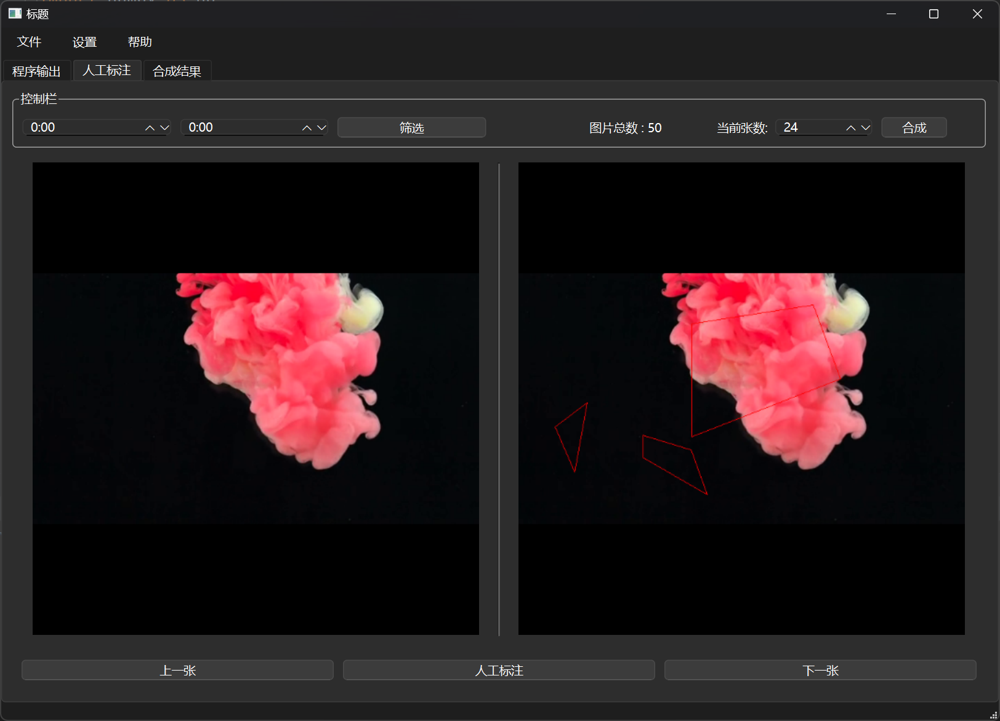

点击合成按钮将人工标注的结果与程序生成的结果进行合成：

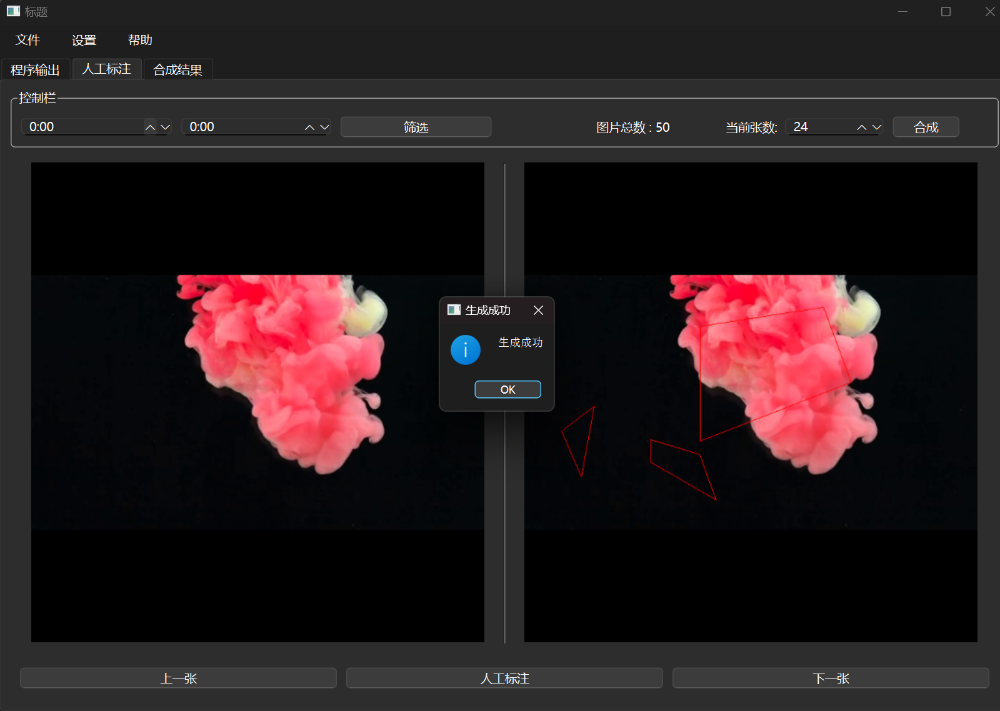

进入“合成结果”子页即可观察合成结果：

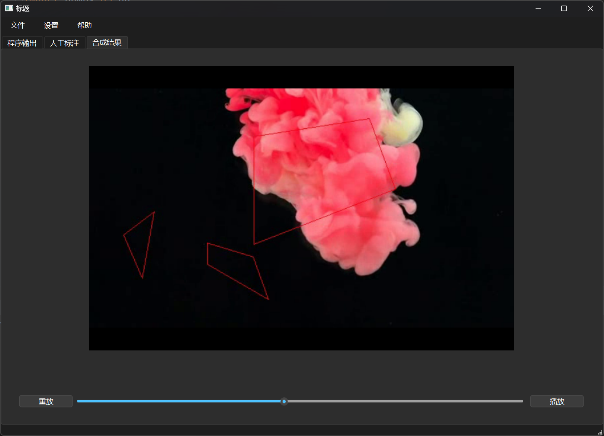

### 文件结构说明
文件结构如下图所示：

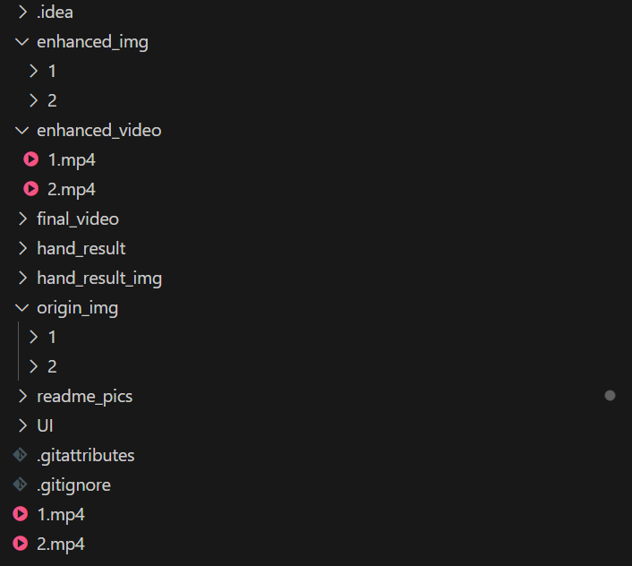

origin_img 为原始视频对应图片的路径

enhanced_video 为处理后的视频的路径

enhanced_img 为处理后的视频对应图片的路径

hand_result 为手工标注结果（json）的路径

hand_result_img 为手工标注图片的路径

final_video 为手工标注与算法结果合成的视频路径

算法部分需要提供原始视频每一帧的图片，处理后的视频及对应的图片。

例如，若上传了video1.mp4作为输入，在origin_img文件夹下应有着video1文件夹，其中存放着原始图片；在enhanced_img文件夹下应有video1文件夹，其中存放着处理后的图片，这些图片应该与原始视频图片有着相同的名称；在enhanced_video文件夹下应有处理后的视频video1.mp4。

以上路径均可在config.yaml中配置修改。

### 添加算法
在LoadThread类里的run函数中添加算法的代码(line 35)：

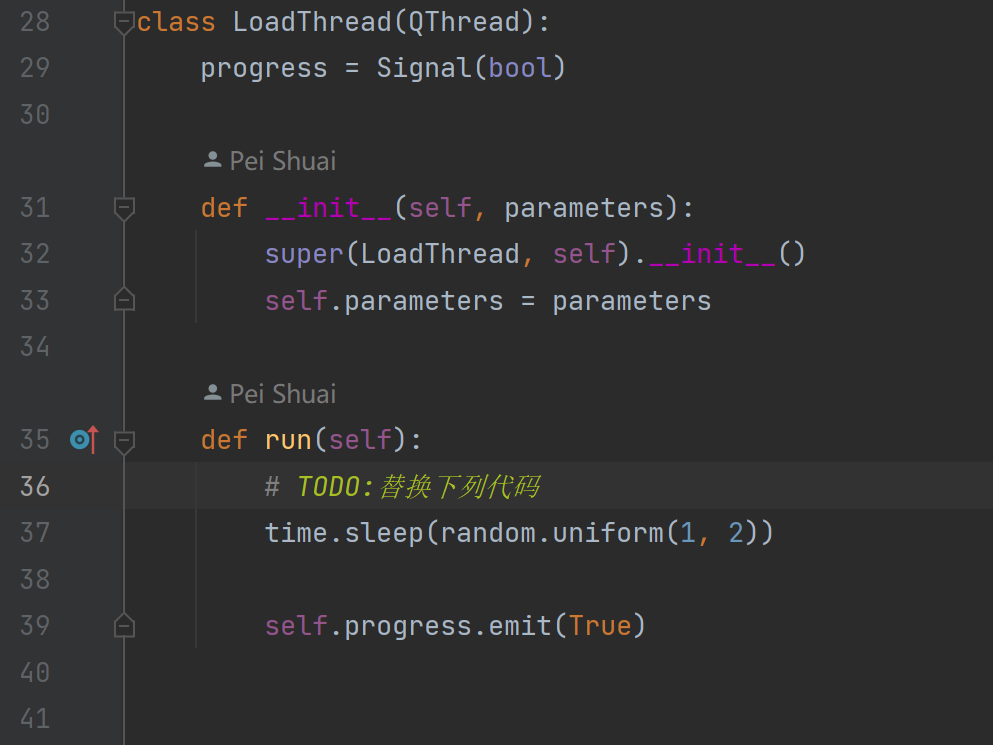

需要用到的参数可通过parameters传递(line 210)，可能用到的参数有：

filename : 输入视频的绝对路径

self.input_path : 输入视频的相对路径

self.input_capture : 输入视频